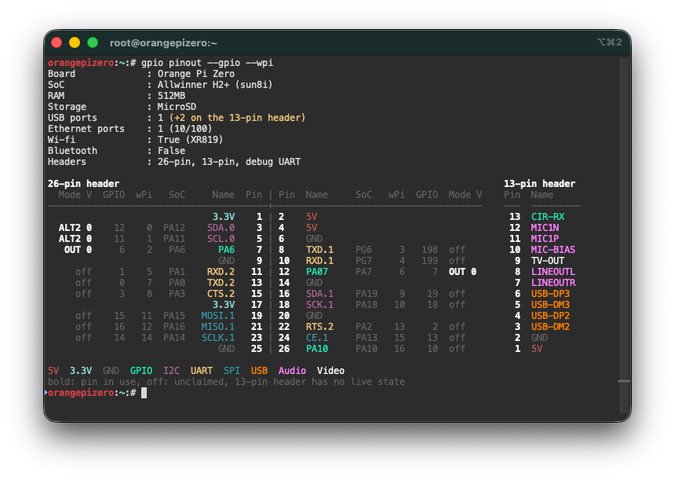

## How to download wiringOP

```
# apt-get update
# apt-get install -y git
# git clone https://github.com/orangepi-xunlong/wiringOP.git
```

## How to build wiringOP

```
# cd wiringOP
# ./build clean
# ./build 
```

---
## The gpio pinout command

`gpio pinout` is a colour coded view of the board headers, in the spirit of the
`pinout` command on a Raspberry Pi. It shows the same data as `gpio readall`,
laid out like the physical header: odd pins on the left, even pins on the
right. Each pin has its name, its SoC pin, and its current mode and value.
Pins that are in use are bold, unclaimed pins show a dim "off". `gpio readall`
is unchanged.



```
# gpio pinout                 the default view
# gpio pinout --wpi           add the wPi numbers
# gpio pinout --gpio          add the Linux GPIO numbers
# gpio pinout --monochrome    no colour
# gpio pinout --color         force colour, for example into "less -R"
```

Colour is only used on a terminal, and never when the `NO_COLOR` environment
variable is set. A header that carries no GPIOs (the 13-pin header of the
Orange Pi Zero: USB, audio, video, IR) is listed next to the main header, or
below it when the terminal is too narrow.

### Verified boards

Only one so far: the **Orange Pi Zero** (Allwinner H2+, Armbian), the only board
the contributor had at hand. There every pin was compared against `gpio readall`:
name, wPi number, GPIO number, mode and value.

On any other board `gpio pinout` does not guess. It says that the board has not
been verified yet and points to `gpio readall` and to the demo below.

### Preview any board without hardware

```
$ gpio pinout --demo              list the boards
$ gpio pinout --demo pc-2         preview one of them
$ gpio pinout --demo 5-plus --wpi
```

The demo prints from wiringOP's own pin tables, the same ones `gpio readall`
uses, for every board wiringOP knows. It needs no root rights and no Orange Pi,
so it also runs on a PC. The pin names and wPi numbers are real. The pin state
is a placeholder, and the SoC and GPIO columns are left out because they are
only known on the real board.

To try it on a machine without installing anything:

```
$ git clone https://github.com/orangepi-xunlong/wiringOP.git
$ cd wiringOP
$ (cd wiringPi && make && ln -sf libwiringPi.so.* libwiringPi.so)
$ (cd devLib && make INCLUDE="-I. -I../wiringPi" && ln -sf libwiringPiDev.so.* libwiringPiDev.so)
$ (cd gpio && make INCLUDE="-I../wiringPi -I../devLib" LDFLAGS="-L../wiringPi -L../devLib")
$ cd gpio
$ LD_LIBRARY_PATH=../wiringPi:../devLib ./gpio pinout --demo zero
```

### How to verify and add your board

1. Build wiringOP on the board and look at `gpio pinout --demo <board>` next to
   `gpio readall`. The names and wPi numbers have to agree.
2. Add one row for the board to the `pinoutModels` table in `gpio/readall.c`:
   the model, its two pin tables, the mode names (`alts_...`) that
   `OrangePiReadAll ()` uses for that model, the pin count, a function that turns
   a GPIO number into a SoC pin name, and the device tree model string
   (`cat /proc/device-tree/model`). `pinoutSunxiPinName` fits the Allwinner
   boards (12 becomes PA12). Other SoC families need a small function of their
   own.
3. Optional: the board facts and a secondary header, see `pinoutBoard_ZERO`.
   They are only shown when the device tree model string matches, because one
   wiringOP model can cover several boards.
4. Build, then compare `gpio pinout --wpi --gpio` with `gpio readall` row by
   row. Change a spare pin with `gpio mode <pin> out` and check that both
   commands follow.
5. Send a pull request that says which board and which OS image it was checked
   on.

The rendering is in `gpio/pinout.c` and has no hardware access. It can be built
and tried on its own with a few lines of test data.

---
## The output of the gpio readall command

## Allwinner H2+

### Orange Pi Zero/R1

```
 +------+-----+----------+------+---+  OPi H2  +---+------+----------+-----+------+
 | GPIO | wPi |   Name   | Mode | V | Physical | V | Mode | Name     | wPi | GPIO |
 +------+-----+----------+------+---+----++----+---+------+----------+-----+------+
 |      |     |     3.3V |      |   |  1 || 2  |   |      | 5V       |     |      |
 |   12 |   0 |    SDA.0 | ALT2 | 0 |  3 || 4  |   |      | 5V       |     |      |
 |   11 |   1 |    SCL.0 | ALT2 | 0 |  5 || 6  |   |      | GND      |     |      |
 |    6 |   2 |    PWM.1 |  OFF | 0 |  7 || 8  | 0 | ALT2 | TXD.1    | 3   | 198  |
 |      |     |      GND |      |   |  9 || 10 | 0 | ALT2 | RXD.1    | 4   | 199  |
 |    1 |   5 |    RXD.2 | ALT2 | 0 | 11 || 12 | 0 | OFF  | PA07     | 6   | 7    |
 |    0 |   7 |    TXD.2 | ALT2 | 0 | 13 || 14 |   |      | GND      |     |      |
 |    3 |   8 |    CTS.2 |  OFF | 0 | 15 || 16 | 0 | ALT3 | SDA.1    | 9   | 19   |
 |      |     |     3.3V |      |   | 17 || 18 | 0 | ALT3 | SCK.1    | 10  | 18   |
 |   15 |  11 |   MOSI.1 | ALT2 | 1 | 19 || 20 |   |      | GND      |     |      |
 |   16 |  12 |   MISO.1 | ALT2 | 0 | 21 || 22 | 0 | OFF  | RTS.2    | 13  | 2    |
 |   14 |  14 |   SCLK.1 | ALT2 | 0 | 23 || 24 | 0 | ALT2 | CE.1     | 15  | 13   |
 |      |     |      GND |      |   | 25 || 26 | 0 | OFF  | PA10     | 16  | 10   |
 +------+-----+----------+------+---+----++----+---+------+----------+-----+------+
 | GPIO | wPi |   Name   | Mode | V | Physical | V | Mode | Name     | wPi | GPIO |
 +------+-----+----------+------+---+  OPi H2  +---+------+----------+-----+------+
```

## Allwinner H3

### Orange Pi Zero Plus 2

```
 +------+-----+----------+------+---+ZEROPLUS 2+---+------+----------+-----+------+
 | GPIO | wPi |   Name   | Mode | V | Physical | V | Mode | Name     | wPi | GPIO |
 +------+-----+----------+------+---+----++----+---+------+----------+-----+------+
 |      |     |     3.3V |      |   |  1 || 2  |   |      | 5V       |     |      |
 |   12 |   0 |    SDA.0 | ALT2 | 0 |  3 || 4  |   |      | 5V       |     |      |
 |   11 |   1 |    SCL.0 | ALT2 | 0 |  5 || 6  |   |      | GND      |     |      |
 |    6 |   2 |      PA6 |  OFF | 0 |  7 || 8  | 0 | ALT2 | TXD.2    | 3   | 0    |
 |      |     |      GND |      |   |  9 || 10 | 0 | ALT2 | RXD.2    | 4   | 1    |
 |  352 |   5 |    S-SCL | ALT2 | 0 | 11 || 12 | 0 | OFF  | PD11     | 6   | 107  |
 |  353 |   7 |    S-SDA | ALT2 | 0 | 13 || 14 |   |      | GND      |     |      |
 |    3 |   8 |    CTS.2 |  OFF | 0 | 15 || 16 | 0 | ALT3 | SDA.1    | 9   | 19   |
 |      |     |     3.3V |      |   | 17 || 18 | 0 | ALT3 | SCL.1    | 10  | 18   |
 |   15 |  11 |   MOSI.1 | ALT2 | 0 | 19 || 20 |   |      | GND      |     |      |
 |   16 |  12 |   MISO.1 | ALT2 | 0 | 21 || 22 | 0 | OFF  | RTS.2    | 13  | 2    |
 |   14 |  14 |   SCLK.1 | ALT2 | 0 | 23 || 24 | 0 | ALT2 | CE.1     | 15  | 13   |
 |      |     |      GND |      |   | 25 || 26 | 0 | OFF  | PD14     | 16  | 110  |
 +------+-----+----------+------+---+----++----+---+------+----------+-----+------+
 | GPIO | wPi |   Name   | Mode | V | Physical | V | Mode | Name     | wPi | GPIO |
 +------+-----+----------+------+---+ZEROPLUS 2+---+------+----------+-----+------+
```

### OrangePi One/Lite/Pc/Plus/PcPlus/Plus2e

```
 +------+-----+----------+------+---+OrangePiH3+---+------+----------+-----+------+
 | GPIO | wPi |   Name   | Mode | V | Physical | V | Mode | Name     | wPi | GPIO |
 +------+-----+----------+------+---+----++----+---+------+----------+-----+------+
 |      |     |     3.3V |      |   |  1 || 2  |   |      | 5V       |     |      |
 |   12 |   0 |    SDA.0 |  OUT | 0 |  3 || 4  |   |      | 5V       |     |      |
 |   11 |   1 |    SCL.0 |  OUT | 0 |  5 || 6  |   |      | GND      |     |      |
 |    6 |   2 |      PA6 |  OUT | 0 |  7 || 8  | 0 | OUT  | TXD.3    | 3   | 13   |
 |      |     |      GND |      |   |  9 || 10 | 0 | OUT  | RXD.3    | 4   | 14   |
 |    1 |   5 |    RXD.2 |  OUT | 0 | 11 || 12 | 0 | OUT  | PD14     | 6   | 110  |
 |    0 |   7 |    TXD.2 |  OUT | 0 | 13 || 14 |   |      | GND      |     |      |
 |    3 |   8 |    CTS.2 |  OUT | 0 | 15 || 16 | 0 | OUT  | PC04     | 9   | 68   |
 |      |     |     3.3V |      |   | 17 || 18 | 0 | OUT  | PC07     | 10  | 71   |
 |   64 |  11 |   MOSI.0 |  OUT | 0 | 19 || 20 |   |      | GND      |     |      |
 |   65 |  12 |   MISO.0 |  OUT | 0 | 21 || 22 | 0 | OUT  | RTS.2    | 13  | 2    |
 |   66 |  14 |   SCLK.0 |  OUT | 0 | 23 || 24 | 0 | OUT  | CE.0     | 15  | 67   |
 |      |     |      GND |      |   | 25 || 26 | 0 | OUT  | PA21     | 16  | 21   |
 |   19 |  17 |    SDA.1 |  OUT | 0 | 27 || 28 | 0 | OUT  | SCL.1    | 18  | 18   |
 |    7 |  19 |     PA07 |  OUT | 0 | 29 || 30 |   |      | GND      |     |      |
 |    8 |  20 |     PA08 |  OUT | 0 | 31 || 32 | 0 | OUT  | RTS.1    | 21  | 200  |
 |    9 |  22 |     PA09 |  OUT | 0 | 33 || 34 |   |      | GND      |     |      |
 |   10 |  23 |     PA10 |  OUT | 0 | 35 || 36 | 0 | OUT  | CTS.1    | 24  | 201  |
 |   20 |  25 |     PA20 |  OUT | 0 | 37 || 38 | 0 | OUT  | TXD.1    | 26  | 198  |
 |      |     |      GND |      |   | 39 || 40 | 0 | OUT  | RXD.1    | 27  | 199  |
 +------+-----+----------+------+---+----++----+---+------+----------+-----+------+
 | GPIO | wPi |   Name   | Mode | V | Physical | V | Mode | Name     | wPi | GPIO |
 +------+-----+----------+------+---+OrangePiH3+---+------+----------+-----+------+
```

## Allwinner H5

### Orange Pi Zero Plus

```
 +------+-----+----------+------+---+ ZEROPLUS +---+------+----------+-----+------+
 | GPIO | wPi |   Name   | Mode | V | Physical | V | Mode | Name     | wPi | GPIO |
 +------+-----+----------+------+---+----++----+---+------+----------+-----+------+
 |      |     |     3.3V |      |   |  1 || 2  |   |      | 5V       |     |      |
 |   12 |   0 |    SDA.0 | ALT2 | 0 |  3 || 4  |   |      | 5V       |     |      |
 |   11 |   1 |    SCL.0 | ALT2 | 0 |  5 || 6  |   |      | GND      |     |      |
 |    6 |   2 |      PA6 |  OFF | 0 |  7 || 8  | 0 | ALT2 | TXD.1    | 3   | 198  |
 |      |     |      GND |      |   |  9 || 10 | 0 | ALT2 | RXD.1    | 4   | 199  |
 |    1 |   5 |    RXD.2 | ALT2 | 0 | 11 || 12 | 0 | OFF  | PA07     | 6   | 7    |
 |    0 |   7 |    TXD.2 | ALT2 | 0 | 13 || 14 |   |      | GND      |     |      |
 |    3 |   8 |    CTS.2 |  OFF | 0 | 15 || 16 | 0 | ALT3 | SDA.1    | 9   | 19   |
 |      |     |     3.3V |      |   | 17 || 18 | 0 | ALT3 | SCL.1    | 10  | 18   |
 |   15 |  11 |   MOSI.1 | ALT2 | 0 | 19 || 20 |   |      | GND      |     |      |
 |   16 |  12 |   MISO.1 | ALT2 | 0 | 21 || 22 | 0 | OFF  | RTS.2    | 13  | 2    |
 |   14 |  14 |   SCLK.1 | ALT2 | 0 | 23 || 24 | 0 | ALT2 | CE.1     | 15  | 13   |
 |      |     |      GND |      |   | 25 || 26 | 0 | OFF  | PA10     | 16  | 10   |
 +------+-----+----------+------+---+----++----+---+------+----------+-----+------+
 | GPIO | wPi |   Name   | Mode | V | Physical | V | Mode | Name     | wPi | GPIO |
 +------+-----+----------+------+---+ ZEROPLUS +---+------+----------+-----+------+
```

### Orange Pi Zero Plus 2

```
 +------+-----+----------+------+---+ZEROPLUS 2+---+------+----------+-----+------+
 | GPIO | wPi |   Name   | Mode | V | Physical | V | Mode | Name     | wPi | GPIO |
 +------+-----+----------+------+---+----++----+---+------+----------+-----+------+
 |      |     |     3.3V |      |   |  1 || 2  |   |      | 5V       |     |      |
 |   12 |   0 |    SDA.0 | ALT2 | 0 |  3 || 4  |   |      | 5V       |     |      |
 |   11 |   1 |    SCL.0 | ALT2 | 0 |  5 || 6  |   |      | GND      |     |      |
 |    6 |   2 |      PA6 |  OFF | 0 |  7 || 8  | 0 | ALT2 | TXD.2    | 3   | 0    |
 |      |     |      GND |      |   |  9 || 10 | 0 | ALT2 | RXD.2    | 4   | 1    |
 |  352 |   5 |    S-SCL | ALT2 | 0 | 11 || 12 | 0 | OFF  | PD11     | 6   | 107  |
 |  353 |   7 |    S-SDA | ALT2 | 0 | 13 || 14 |   |      | GND      |     |      |
 |    3 |   8 |    CTS.2 |  OFF | 0 | 15 || 16 | 0 | ALT3 | SDA.1    | 9   | 19   |
 |      |     |     3.3V |      |   | 17 || 18 | 0 | ALT3 | SCL.1    | 10  | 18   |
 |   15 |  11 |   MOSI.1 | ALT2 | 0 | 19 || 20 |   |      | GND      |     |      |
 |   16 |  12 |   MISO.1 | ALT2 | 0 | 21 || 22 | 0 | OFF  | RTS.2    | 13  | 2    |
 |   14 |  14 |   SCLK.1 | ALT2 | 0 | 23 || 24 | 0 | ALT2 | CE.1     | 15  | 13   |
 |      |     |      GND |      |   | 25 || 26 | 0 | OFF  | PD14     | 16  | 110  |
 +------+-----+----------+------+---+----++----+---+------+----------+-----+------+
 | GPIO | wPi |   Name   | Mode | V | Physical | V | Mode | Name     | wPi | GPIO |
 +------+-----+----------+------+---+ZEROPLUS 2+---+------+----------+-----+------+
```

### Orange Pi Pc 2

```
 +------+-----+----------+------+---+  OPi PC2 +---+------+----------+-----+------+
 | GPIO | wPi |   Name   | Mode | V | Physical | V | Mode | Name     | wPi | GPIO |
 +------+-----+----------+------+---+----++----+---+------+----------+-----+------+
 |      |     |     3.3V |      |   |  1 || 2  |   |      | 5V       |     |      |
 |   12 |   0 |    SDA.0 | ALT2 | 0 |  3 || 4  |   |      | 5V       |     |      |
 |   11 |   1 |    SCL.0 | ALT2 | 0 |  5 || 6  |   |      | GND      |     |      |
 |    6 |   2 |    PWM.1 |  OFF | 0 |  7 || 8  | 0 | OFF  | PC05     | 3   | 69   |
 |      |     |      GND |      |   |  9 || 10 | 0 | OFF  | PC06     | 4   | 70   |
 |    1 |   5 |    RXD.2 | ALT2 | 0 | 11 || 12 | 0 | OFF  | PD14     | 6   | 110  |
 |    0 |   7 |    TXD.2 | ALT2 | 0 | 13 || 14 |   |      | GND      |     |      |
 |    3 |   8 |    CTS.2 | ALT2 | 0 | 15 || 16 | 0 | OFF  | PC04     | 9   | 68   |
 |      |     |     3.3V |      |   | 17 || 18 | 0 | OFF  | PC07     | 10  | 71   |
 |   15 |  11 |   MOSI.1 | ALT2 | 0 | 19 || 20 |   |      | GND      |     |      |
 |   16 |  12 |   MISO.1 | ALT2 | 0 | 21 || 22 | 0 | ALT2 | RTS.2    | 13  | 2    |
 |   14 |  14 |   SCLK.1 | ALT2 | 0 | 23 || 24 | 0 | ALT2 | CE.1     | 15  | 13   |
 |      |     |      GND |      |   | 25 || 26 | 0 | OFF  | PA21     | 16  | 21   |
 |   19 |  17 |    SDA.1 | ALT3 | 0 | 27 || 28 | 0 | ALT3 | SCL.1    | 18  | 18   |
 |    7 |  19 |     PA07 |  OFF | 0 | 29 || 30 |   |      | GND      |     |      |
 |    8 |  20 |     PA08 |  OFF | 0 | 31 || 32 | 0 | ALT2 | RTS.1    | 21  | 200  |
 |    9 |  22 |     PA09 |  OFF | 0 | 33 || 34 |   |      | GND      |     |      |
 |   10 |  23 |     PA10 |  OFF | 0 | 35 || 36 | 0 | ALT2 | CTS.1    | 24  | 201  |
 |  107 |  25 |     PD11 |  OFF | 0 | 37 || 38 | 0 | ALT2 | TXD.1    | 26  | 198  |
 |      |     |      GND |      |   | 39 || 40 | 0 | ALT2 | RXD.1    | 27  | 199  |
 +------+-----+----------+------+---+----++----+---+------+----------+-----+------+
 | GPIO | wPi |   Name   | Mode | V | Physical | V | Mode | Name     | wPi | GPIO |
 +------+-----+----------+------+---+  OPi PC2 +---+------+----------+-----+------+
```

### Orange Pi Prime

```
 +------+-----+----------+------+---+   PRIME  +---+------+----------+-----+------+
 | GPIO | wPi |   Name   | Mode | V | Physical | V | Mode | Name     | wPi | GPIO |
 +------+-----+----------+------+---+----++----+---+------+----------+-----+------+
 |      |     |     3.3V |      |   |  1 || 2  |   |      | 5V       |     |      |
 |   12 |   0 |    SDA.0 | ALT2 | 0 |  3 || 4  |   |      | 5V       |     |      |
 |   11 |   1 |    SCL.0 | ALT2 | 0 |  5 || 6  |   |      | GND      |     |      |
 |    6 |   2 |    PWM.1 |  OFF | 0 |  7 || 8  | 0 | OFF  | PC05     | 3   | 69   |
 |      |     |      GND |      |   |  9 || 10 | 0 | OFF  | PC06     | 4   | 70   |
 |    1 |   5 |    RXD.2 | ALT2 | 0 | 11 || 12 | 0 | OFF  | PD14     | 6   | 110  |
 |    0 |   7 |    TXD.2 | ALT2 | 0 | 13 || 14 |   |      | GND      |     |      |
 |    3 |   8 |    CTS.2 | ALT2 | 0 | 15 || 16 | 0 | OFF  | PC04     | 9   | 68   |
 |      |     |     3.3V |      |   | 17 || 18 | 0 | OFF  | PC07     | 10  | 71   |
 |   15 |  11 |   MOSI.1 | ALT2 | 0 | 19 || 20 |   |      | GND      |     |      |
 |   16 |  12 |   MISO.1 | ALT2 | 0 | 21 || 22 | 0 | ALT2 | RTS.2    | 13  | 2    |
 |   14 |  14 |   SCLK.1 | ALT2 | 0 | 23 || 24 | 0 | ALT2 | CE.1     | 15  | 13   |
 |      |     |      GND |      |   | 25 || 26 | 0 | OFF  | PC08     | 16  | 72   |
 |   19 |  17 |    SDA.1 | ALT3 | 0 | 27 || 28 | 0 | ALT3 | SCL.1    | 18  | 18   |
 |    7 |  19 |     PA07 |  OFF | 0 | 29 || 30 |   |      | GND      |     |      |
 |    8 |  20 |     PA08 |  OFF | 0 | 31 || 32 | 0 | OFF  | PC09     | 21  | 73   |
 |    9 |  22 |     PA09 |  OFF | 0 | 33 || 34 |   |      | GND      |     |      |
 |   10 |  23 |     PA10 |  OFF | 0 | 35 || 36 | 0 | OFF  | PC10     | 24  | 74   |
 |  107 |  25 |     PD11 |  OFF | 0 | 37 || 38 | 0 | OFF  | PC11     | 26  | 75   |
 |      |     |      GND |      |   | 39 || 40 | 0 | OFF  | PC12     | 27  | 76   |
 +------+-----+----------+------+---+----++----+---+------+----------+-----+------+
 | GPIO | wPi |   Name   | Mode | V | Physical | V | Mode | Name     | wPi | GPIO |
 +------+-----+----------+------+---+   PRIME  +---+------+----------+-----+------+
```

## Allwinner A64 

### Orange Pi Win/Winplus

```
 +------+-----+----------+------+---+ OPi Win  +---+------+----------+-----+------+
 | GPIO | wPi |   Name   | Mode | V | Physical | V | Mode | Name     | wPi | GPIO |
 +------+-----+----------+------+---+----++----+---+------+----------+-----+------+
 |      |     |     3.3V |      |   |  1 || 2  |   |      | 5V       |     |      |
 |  227 |   0 |    SDA.1 | ALT2 | 0 |  3 || 4  |   |      | 5V       |     |      |
 |  226 |   1 |    SCL.1 | ALT2 | 0 |  5 || 6  |   |      | GND      |     |      |
 |  362 |   2 |     PL10 |  OFF | 0 |  7 || 8  | 0 | ALT2 | PL02     | 3   | 354  |
 |      |     |      GND |      |   |  9 || 10 | 0 | ALT2 | PL03     | 4   | 355  |
 |  229 |   5 |    RXD.3 | ALT2 | 0 | 11 || 12 | 0 | OFF  | PD04     | 6   | 100  |
 |  228 |   7 |    TXD.3 | ALT2 | 0 | 13 || 14 |   |      | GND      |     |      |
 |  231 |   8 |    CTS.3 |  OUT | 0 | 15 || 16 | 0 | OFF  | PL09     | 9   | 361  |
 |      |     |     3.3V |      |   | 17 || 18 | 0 | OFF  | PC04     | 10  | 68   |
 |   98 |  11 |   MOSI.1 | ALT4 | 0 | 19 || 20 |   |      | GND      |     |      |
 |   99 |  12 |   MISO.1 | ALT4 | 0 | 21 || 22 | 0 | OFF  | RTS.3    | 13  | 230  |
 |   97 |  14 |   SCLK.1 | ALT4 | 0 | 23 || 24 | 0 | ALT4 | CE.1     | 15  | 96   |
 |      |     |      GND |      |   | 25 || 26 | 0 | OFF  | PD06     | 16  | 102  |
 |  143 |  17 |    SDA.2 | ALT3 | 0 | 27 || 28 | 0 | ALT3 | SCL.2    | 18  | 142  |
 |   36 |  19 |     PB04 |  OFF | 0 | 29 || 30 |   |      | GND      |     |      |
 |   37 |  20 |     PB05 |  OFF | 0 | 31 || 32 | 0 | ALT2 | RTS.2    | 21  | 34   |
 |   38 |  22 |     PB06 |  OFF | 0 | 33 || 34 |   |      | GND      |     |      |
 |   39 |  23 |     PB07 |  OFF | 0 | 35 || 36 | 0 | ALT2 | CTS.2    | 24  | 35   |
 |  101 |  25 |     PD05 |  OFF | 0 | 37 || 38 | 0 | ALT2 | TXD.2    | 26  | 32   |
 |      |     |      GND |      |   | 39 || 40 | 0 | ALT2 | RXD.2    | 27  | 33   |
 +------+-----+----------+------+---+----++----+---+------+----------+-----+------+
 | GPIO | wPi |   Name   | Mode | V | Physical | V | Mode | Name     | wPi | GPIO |
 +------+-----+----------+------+---+ OPi Win  +---+------+----------+-----+------+
```

## Allwinner H6

### Orange Pi 3/3 LTS

```
 +------+-----+----------+------+---+   OPi 3  +---+------+----------+-----+------+
 | GPIO | wPi |   Name   | Mode | V | Physical | V | Mode | Name     | wPi | GPIO |
 +------+-----+----------+------+---+----++----+---+------+----------+-----+------+
 |      |     |     3.3V |      |   |  1 || 2  |   |      | 5V       |     |      |
 |  122 |   0 |    SDA.0 |  OFF | 0 |  3 || 4  |   |      | 5V       |     |      |
 |  121 |   1 |    SCL.0 |  OFF | 0 |  5 || 6  |   |      | GND      |     |      |
 |  118 |   2 |    PWM.0 |  OFF | 0 |  7 || 8  | 0 | OFF  | PL02     | 3   | 354  |
 |      |     |      GND |      |   |  9 || 10 | 0 | OFF  | PL03     | 4   | 355  |
 |  120 |   5 |    RXD.3 | ALT4 | 0 | 11 || 12 | 0 | OFF  | PD18     | 6   | 114  |
 |  119 |   7 |    TXD.3 | ALT4 | 0 | 13 || 14 |   |      | GND      |     |      |
 |  362 |   8 |     PL10 |  OFF | 0 | 15 || 16 | 0 | OFF  | PD15     | 9   | 111  |
 |      |     |     3.3V |      |   | 17 || 18 | 0 | OFF  | PD16     | 10  | 112  |
 |  229 |  11 |   MOSI.1 | ALT2 | 0 | 19 || 20 |   |      | GND      |     |      |
 |  230 |  12 |   MISO.1 | ALT2 | 0 | 21 || 22 | 0 | OFF  | PD21     | 13  | 117  |
 |  228 |  14 |   SCLK.1 | ALT2 | 0 | 23 || 24 | 0 | ALT2 | CE.1     | 15  | 227  |
 |      |     |      GND |      |   | 25 || 26 | 0 | OFF  | PL08     | 16  | 360  |
 +------+-----+----------+------+---+----++----+---+------+----------+-----+------+
 | GPIO | wPi |   Name   | Mode | V | Physical | V | Mode | Name     | wPi | GPIO |
 +------+-----+----------+------+---+   OPi 3  +---+------+----------+-----+------+
```

### Orange Pi Lite2/OnePlus

```
 +------+-----+----------+------+---+  OPi H6  +---+------+----------+-----+------+
 | GPIO | wPi |   Name   | Mode | V | Physical | V | Mode | Name     | wPi | GPIO |
 +------+-----+----------+------+---+----++----+---+------+----------+-----+------+
 |      |     |     3.3V |      |   |  1 || 2  |   |      | 5V       |     |      |
 |  230 |   0 |    SDA.1 |  OFF | 0 |  3 || 4  |   |      | 5V       |     |      |
 |  229 |   1 |    SCL.1 |  OFF | 0 |  5 || 6  |   |      | GND      |     |      |
 |  228 |   2 |     PWM1 |  OFF | 0 |  7 || 8  | 0 | OFF  | PD21     | 3   | 117  |
 |      |     |      GND |      |   |  9 || 10 | 0 | OFF  | PD22     | 4   | 118  |
 |  120 |   5 |    RXD.3 | ALT4 | 0 | 11 || 12 | 0 | OFF  | PC09     | 6   | 73   |
 |  119 |   7 |    TXD.3 | ALT4 | 0 | 13 || 14 |   |      | GND      |     |      |
 |  122 |   8 |    CTS.3 |  OFF | 0 | 15 || 16 | 0 | OFF  | PC08     | 9   | 72   |
 |      |     |     3.3V |      |   | 17 || 18 | 0 | OFF  | PC07     | 10  | 71   |
 |   66 |  11 |   MOSI.0 | ALT4 | 0 | 19 || 20 |   |      | GND      |     |      |
 |   67 |  12 |   MISO.0 | ALT4 | 0 | 21 || 22 | 0 | OFF  | RTS.3    | 13  | 121  |
 |   64 |  14 |   SCLK.0 | ALT4 | 0 | 23 || 24 | 0 | ALT4 | CE.0     | 15  | 69   |
 |      |     |      GND |      |   | 25 || 26 | 0 | OFF  | PH03     | 16  | 227  |
 +------+-----+----------+------+---+----++----+---+------+----------+-----+------+
 | GPIO | wPi |   Name   | Mode | V | Physical | V | Mode | Name     | wPi | GPIO |
 +------+-----+----------+------+---+  OPi H6  +---+------+----------+-----+------+
```

## Allwinner H616

### Orange Pi Zero2/Zero2 LTS/Zero2 B

```
 +------+-----+----------+------+---+  Zero 2  +---+------+----------+-----+------+
 | GPIO | wPi |   Name   | Mode | V | Physical | V | Mode | Name     | wPi | GPIO |
 +------+-----+----------+------+---+----++----+---+------+----------+-----+------+
 |      |     |     3.3V |      |   |  1 || 2  |   |      | 5V       |     |      |
 |  229 |   0 |    SDA.3 |  OFF | 0 |  3 || 4  |   |      | 5V       |     |      |
 |  228 |   1 |    SCL.3 |  OFF | 0 |  5 || 6  |   |      | GND      |     |      |
 |   73 |   2 |      PC9 |  OFF | 0 |  7 || 8  | 0 | ALT2 | TXD.5    | 3   | 226  |
 |      |     |      GND |      |   |  9 || 10 | 0 | ALT2 | RXD.5    | 4   | 227  |
 |   70 |   5 |      PC6 | ALT5 | 0 | 11 || 12 | 0 | OFF  | PC11     | 6   | 75   |
 |   69 |   7 |      PC5 | ALT5 | 0 | 13 || 14 |   |      | GND      |     |      |
 |   72 |   8 |      PC8 |  OFF | 0 | 15 || 16 | 0 | OFF  | PC15     | 9   | 79   |
 |      |     |     3.3V |      |   | 17 || 18 | 0 | OFF  | PC14     | 10  | 78   |
 |  231 |  11 |   MOSI.1 | ALT4 | 0 | 19 || 20 |   |      | GND      |     |      |
 |  232 |  12 |   MISO.1 | ALT4 | 0 | 21 || 22 | 0 | OFF  | PC7      | 13  | 71   |
 |  230 |  14 |   SCLK.1 | ALT4 | 0 | 23 || 24 | 0 | ALT4 | CE.1     | 15  | 233  |
 |      |     |      GND |      |   | 25 || 26 | 0 | OFF  | PC10     | 16  | 74   |
 |   65 |  17 |      PC1 |  OFF | 0 | 27 || 28 |   |      |          |     |      |
 |  272 |  18 |     PI16 |  OFF | 0 | 29 || 30 |   |      |          |     |      |
 |  262 |  19 |      PI6 |  OFF | 0 | 31 || 32 |   |      |          |     |      |
 |  234 |  20 |     PH10 | ALT3 | 0 | 33 || 34 |   |      |          |     |      |
 +------+-----+----------+------+---+----++----+---+------+----------+-----+------+
 | GPIO | wPi |   Name   | Mode | V | Physical | V | Mode | Name     | wPi | GPIO |
 +------+-----+----------+------+---+  Zero 2  +---+------+----------+-----+------+
```

## RockChip RK3399 

### Orange Pi RK3399

```
 +------+-----+----------+------+---+OPi RK3399+---+------+----------+-----+------+
 | GPIO | wPi |   Name   | Mode | V | Physical | V | Mode | Name     | wPi | GPIO |
 +------+-----+----------+------+---+----++----+---+------+----------+-----+------+
 |      |     |     3.3V |      |   |  1 || 2  |   |      | 5V       |     |      |
 |   43 |   0 |    SDA.0 | ALT2 | 1 |  3 || 4  |   |      | 5V       |     |      |
 |   44 |   1 |    SCL.0 | ALT2 | 1 |  5 || 6  |   |      | GND      |     |      |
 |   64 |   2 |    GPIO4 | ALT3 | 0 |  7 || 8  | 0 | ALT2 | Tx       | 3   | 148  |
 |      |     |      GND |      |   |  9 || 10 | 1 | ALT2 | Rx       | 4   | 147  |
 |   80 |   5 |   GPIO17 | ALT2 | 0 | 11 || 12 | 0 | ALT3 | GPIO18   | 6   | 65   |
 |   81 |   7 |   GPIO27 | ALT2 | 0 | 13 || 14 |   |      | GND      |     |      |
 |   82 |   8 |   GPIO22 | ALT2 | 0 | 15 || 16 | 0 | IN   | GPIO23   | 9   | 66   |
 |      |     |     3.3V |      |   | 17 || 18 | 0 | IN   | GPIO24   | 10  | 67   |
 |   39 |  11 |     MOSI | ALT2 | 1 | 19 || 20 |   |      | GND      |     |      |
 |   40 |  12 |     MISO | ALT2 | 1 | 21 || 22 | 0 | ALT2 | GPIO25   | 13  | 83   |
 |   41 |  14 |     SCLK | ALT3 | 1 | 23 || 24 | 1 | ALT3 | CS0      | 15  | 42   |
 |      |     |      GND |      |   | 25 || 26 | 0 | ALT2 | CS1      | 16  | 133  |
 |  154 |  17 |     DNP1 |   IN | 0 | 27 || 28 | 1 | IN   | DNP2     | 18  | 50   |
 |   68 |  19 |    GPIO5 |  OUT | 1 | 29 || 30 |   |      | GND      |     |      |
 |   69 |  20 |    GPIO6 |  OUT | 1 | 31 || 32 | 1 | OUT  | GPIO12   | 21  | 76   |
 |   70 |  22 |   GPIO13 |  OUT | 1 | 33 || 34 |   |      | GND      |     |      |
 |   71 |  23 |   GPIO19 |  OUT | 1 | 35 || 36 | 1 | OUT  | GPIO16   | 24  | 73   |
 |   72 |  25 |   GPIO26 |  OUT | 1 | 37 || 38 | 0 | IN   | GPIO20   | 26  | 74   |
 |      |     |      GND |      |   | 39 || 40 | 0 | ALT4 | GPIO21   | 27  | 75   |
 +------+-----+----------+------+---+----++----+---+------+----------+-----+------+
 | GPIO | wPi |   Name   | Mode | V | Physical | V | Mode | Name     | wPi | GPIO |
 +------+-----+----------+------+---+OPi RK3399+---+------+----------+-----+------+
 ```
 
 ### Orange Pi 4/4B/4 LTS

 ```
 +------+-----+----------+------+---+OrangePi 4+---+---+--+----------+-----+------+
 | GPIO | wPi |   Name   | Mode | V | Physical | V | Mode | Name     | wPi | GPIO |
 +------+-----+----------+------+---+----++----+---+------+----------+-----+------+
 |      |     |     3.3V |      |   |  1 || 2  |   |      | 5V       |     |      |
 |   64 |   0 | I2C2_SDA | ALT3 | 0 |  3 || 4  |   |      | 5V       |     |      |
 |   65 |   1 | I2C2_SCL | ALT3 | 0 |  5 || 6  |   |      | GND      |     |      |
 |  150 |   2 |     PWM1 |   IN | 0 |  7 || 8  | 1 | ALT2 | I2C3_SCL | 3   | 145  |
 |      |     |      GND |      |   |  9 || 10 | 1 | ALT2 | I2C3_SDA | 4   | 144  |
 |   33 |   5 | GPIO1_A1 |   IN | 0 | 11 || 12 | 1 | IN   | GPIO1_C2 | 6   | 50   |
 |   35 |   7 | GPIO1_A3 |  OUT | 0 | 13 || 14 |   |      | GND      |     |      |
 |   92 |   8 | GPIO2_D4 |  OUT | 1 | 15 || 16 | 0 | IN   | GPIO1_C6 | 9   | 54   |
 |      |     |     3.3V |      |   | 17 || 18 | 0 | IN   | GPIO1_C7 | 10  | 55   |
 |   40 |  11 | SPI1_TXD | ALT2 | 1 | 19 || 20 |   |      | GND      |     |      |
 |   39 |  12 | SPI1_RXD | ALT2 | 1 | 21 || 22 | 0 | IN   | GPIO1_D0 | 13  | 56   |
 |   41 |  14 | SPI1_CLK | ALT3 | 1 | 23 || 24 | 1 | ALT3 | SPI1_CS  | 15  | 42   |
 |      |     |      GND |      |   | 25 || 26 | 0 | IN   | GPIO4_C5 | 16  | 149  |
 |   64 |  17 | I2C2_SDA | ALT3 | 0 | 27 || 28 | 0 | ALT3 | I2C2_SCL | 18  | 65   |
 |      |     |  I2S0_RX |      |   | 29 || 30 |   |      | GND      |     |      |
 |      |     |  I2S0_TX |      |   | 31 || 32 |   |      | I2S_CLK  |     |      |
 |      |     | I2S0_SCK |      |   | 33 || 34 |   |      | GND      |     |      |
 |      |     | I2S0_SI0 |      |   | 35 || 36 |   |      | I2S0_SO0 |     |      |
 |      |     | I2S0_SI1 |      |   | 37 || 38 |   |      | I2S0_SI2 |     |      |
 |      |     |      GND |      |   | 39 || 40 |   |      | I2S0_SI3 |     |      |
 +------+-----+----------+------+---+----++----+---+------+----------+-----+------+
 | GPIO | wPi |   Name   | Mode | V | Physical | V | Mode | Name     | wPi | GPIO |
 +------+-----+----------+------+---+OrangePi 4+---+---+--+----------+-----+------+
```
